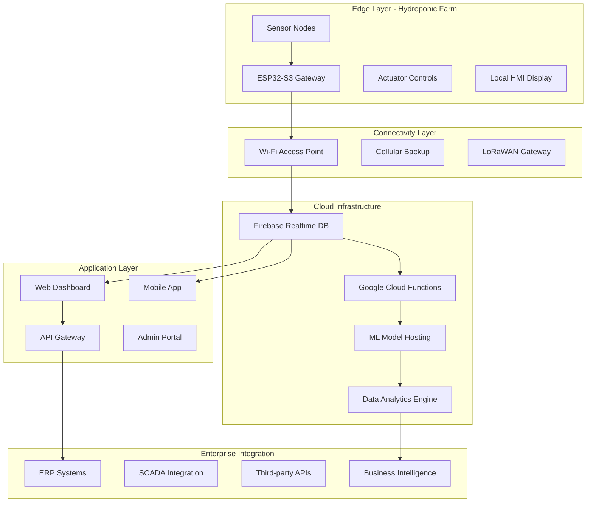

# 🌐 IoT System Architecture & Design

## 🏗️ Enterprise-Grade IoT Architecture

### System Overview - Smart Hydroponic Platform



## 🔧 Edge Computing Architecture

### ESP32-S3 Microcontroller System Design

#### Multi-Core Processing Strategy
```cpp
// Professional IoT edge architecture implementation
#include "freertos/FreeRTOS.h"
#include "freertos/task.h"
#include "freertos/queue.h"
#include "esp_system.h"

class IoTSystemManager {
private:
    // Core 0: Real-time sensor processing
    TaskHandle_t sensorTaskHandle;
    TaskHandle_t controlTaskHandle;
    
    // Core 1: Communication and cloud connectivity
    TaskHandle_t cloudTaskHandle;
    TaskHandle_t localUITaskHandle;
    
    // Inter-core communication
    QueueHandle_t sensorDataQueue;
    QueueHandle_t commandQueue;
    
public:
    void initializeSystem() {
        createQueues();
        startTasks();
        initializeWatchdog();
    }
    
    void createTasks() {
        // High-priority real-time tasks on Core 0
        xTaskCreatePinnedToCore(
            sensorProcessingTask,
            "SensorTask",
            4096,
            this,
            5,  // High priority
            &sensorTaskHandle,
            0   // Core 0
        );
        
        // Communication tasks on Core 1
        xTaskCreatePinnedToCore(
            cloudCommunicationTask,
            "CloudTask", 
            8192,
            this,
            3,  // Medium priority
            &cloudTaskHandle,
            1   // Core 1
        );
    }
};

// Real-time sensor processing (Core 0)
void sensorProcessingTask(void* parameter) {
    IoTSystemManager* manager = (IoTSystemManager*)parameter;
    TickType_t xLastWakeTime = xTaskGetTickCount();
    
    while(1) {
        // Critical timing: 100ms sensor reading cycle
        SensorData data = readAllSensors();
        processLocalAnalytics(data);
        executeEmergencyProtocols(data);
        
        // Send to cloud communication task
        xQueueSend(manager->sensorDataQueue, &data, 0);
        
        // Precise timing control
        vTaskDelayUntil(&xLastWakeTime, pdMS_TO_TICKS(100));
    }
}

// Cloud communication (Core 1)
void cloudCommunicationTask(void* parameter) {
    while(1) {
        SensorData data;
        if(xQueueReceive(sensorDataQueue, &data, portMAX_DELAY)) {
            uploadToFirebase(data);
            checkCloudCommands();
            updateLocalDisplay(data);
        }
    }
}
```

#### Memory Management Strategy
```cpp
// Optimized memory allocation for IoT applications
class MemoryManager {
private:
    // Static allocation for critical data
    static SensorData sensorBuffer[BUFFER_SIZE];
    static uint8_t networkBuffer[NETWORK_BUFFER_SIZE];
    
    // Dynamic allocation tracking
    size_t totalAllocated;
    size_t peakUsage;
    
public:
    void* allocateMemory(size_t size) {
        void* ptr = heap_caps_malloc(size, MALLOC_CAP_8BIT);
        if(ptr) {
            totalAllocated += size;
            updatePeakUsage();
        }
        return ptr;
    }
    
    void monitorMemoryHealth() {
        size_t freeHeap = esp_get_free_heap_size();
        size_t minFreeHeap = esp_get_minimum_free_heap_size();
        
        if(freeHeap < CRITICAL_MEMORY_THRESHOLD) {
            triggerMemoryCleanup();
        }
        
        logMemoryStatistics(freeHeap, minFreeHeap);
    }
};
```

## 🌐 Communication Protocols & Networking

### Multi-Protocol Communication Stack

#### Wi-Fi Implementation with Resilience
```cpp
class WiFiManager {
private:
    wifi_config_t wifi_config;
    bool isConnected;
    uint32_t reconnectAttempts;
    
public:
    void initializeWiFi() {
        wifi_init_config_t cfg = WIFI_INIT_CONFIG_DEFAULT();
        ESP_ERROR_CHECK(esp_wifi_init(&cfg));
        
        // Configure for station mode with power saving
        ESP_ERROR_CHECK(esp_wifi_set_mode(WIFI_MODE_STA));
        ESP_ERROR_CHECK(esp_wifi_set_ps(WIFI_PS_MIN_MODEM));
        
        setupCredentials();
        registerEventHandlers();
    }
    
    void handleDisconnection() {
        if(reconnectAttempts < MAX_RECONNECT_ATTEMPTS) {
            esp_wifi_connect();
            reconnectAttempts++;
        } else {
            // Switch to offline mode
            enableOfflineMode();
            scheduleReconnectAttempt();
        }
    }
    
    void enableOfflineMode() {
        // Store data locally for later upload
        saveDataToFlash();
        
        // Continue critical operations
        maintainLocalControl();
        
        // Indicate offline status
        updateStatusLED(OFFLINE_STATE);
    }
};
```

#### MQTT Implementation for IoT Messaging
```cpp
class MQTTManager {
private:
    esp_mqtt_client_handle_t client;
    char deviceTopic[64];
    char commandTopic[64];
    
public:
    void initializeMQTT() {
        esp_mqtt_client_config_t mqtt_cfg = {
            .uri = CONFIG_MQTT_BROKER_URL,
            .username = CONFIG_MQTT_USERNAME,
            .password = CONFIG_MQTT_PASSWORD,
            .client_id = getDeviceID(),
            .keepalive = 60,
            .clean_session = true
        };
        
        client = esp_mqtt_client_init(&mqtt_cfg);
        esp_mqtt_client_register_event(client, ESP_EVENT_ANY_ID, 
                                     mqtt_event_handler, this);
        esp_mqtt_client_start(client);
    }
    
    void publishSensorData(const SensorData& data) {
        cJSON* json = cJSON_CreateObject();
        cJSON_AddNumberToObject(json, "temperature", data.temperature);
        cJSON_AddNumberToObject(json, "humidity", data.humidity);
        cJSON_AddNumberToObject(json, "ph", data.ph);
        cJSON_AddNumberToObject(json, "tds", data.tds);
        cJSON_AddNumberToObject(json, "timestamp", data.timestamp);
        
        char* jsonString = cJSON_Print(json);
        
        esp_mqtt_client_publish(client, deviceTopic, jsonString, 
                              strlen(jsonString), 1, 0);
        
        free(jsonString);
        cJSON_Delete(json);
    }
};
```

### HTTP/HTTPS RESTful API Integration
```cpp
class HTTPClient {
private:
    esp_http_client_handle_t client;
    char authToken[256];
    
public:
    esp_err_t postSensorData(const SensorData& data) {
        esp_http_client_config_t config = {
            .url = CONFIG_API_ENDPOINT,
            .method = HTTP_METHOD_POST,
            .timeout_ms = 5000,
            .cert_pem = server_cert_pem_start,
        };
        
        client = esp_http_client_init(&config);
        
        // Set headers
        esp_http_client_set_header(client, "Content-Type", "application/json");
        esp_http_client_set_header(client, "Authorization", authToken);
        
        // Prepare JSON payload
        cJSON* payload = createJSONPayload(data);
        char* jsonString = cJSON_Print(payload);
        
        esp_http_client_set_post_field(client, jsonString, strlen(jsonString));
        
        esp_err_t err = esp_http_client_perform(client);
        
        if(err == ESP_OK) {
            int statusCode = esp_http_client_get_status_code(client);
            handleHTTPResponse(statusCode);
        }
        
        cleanup(client, jsonString, payload);
        return err;
    }
};
```

## ☁️ Cloud Infrastructure & Scalability

### Firebase Real-time Database Architecture

#### Data Structure Design
```json
{
  "devices": {
    "ESP32_001": {
      "location": "Greenhouse_A",
      "lastSeen": "2024-01-15T10:30:00Z",
      "status": "online",
      "configuration": {
        "samplingInterval": 60,
        "alertThresholds": {
          "phMin": 5.5,
          "phMax": 6.5,
          "tempMax": 25.0
        }
      }
    }
  },
  "sensorData": {
    "ESP32_001": {
      "2024-01-15": {
        "10:30:00": {
          "temperature": 22.5,
          "humidity": 65.2,
          "ph": 6.1,
          "tds": 850,
          "waterLevel": 75.5,
          "timestamp": 1705315800
        }
      }
    }
  },
  "alerts": {
    "active": {
      "alert_001": {
        "deviceId": "ESP32_001",
        "type": "pH_HIGH",
        "value": 7.2,
        "threshold": 6.5,
        "timestamp": "2024-01-15T10:30:00Z",
        "acknowledged": false
      }
    }
  },
  "controls": {
    "ESP32_001": {
      "commands": {
        "nutrientPump": false,
        "phUp": false,
        "phDown": false,
        "waterPump": true
      },
      "lastUpdated": "2024-01-15T10:30:00Z"
    }
  }
}
```

#### Firebase Cloud Functions for Backend Logic
```javascript
// Professional Node.js Firebase Cloud Functions
const functions = require('firebase-functions');
const admin = require('firebase-admin');
const { BigQuery } = require('@google-cloud/bigquery');
const { PubSub } = require('@google-cloud/pubsub');

admin.initializeApp();

// Real-time data processing and alerting
exports.processSensorData = functions.database
  .ref('/sensorData/{deviceId}/{date}/{time}')
  .onCreate(async (snapshot, context) => {
    const sensorData = snapshot.val();
    const deviceId = context.params.deviceId;
    
    try {
      // Validate data integrity
      if (!validateSensorData(sensorData)) {
        throw new Error('Invalid sensor data received');
      }
      
      // Check alert thresholds
      const alerts = await checkAlertThresholds(deviceId, sensorData);
      
      // Store in BigQuery for analytics
      await storeToBigQuery(deviceId, sensorData);
      
      // Run ML predictions
      const predictions = await runMLPredictions(sensorData);
      
      // Send automated control commands
      if (predictions.requiresAction) {
        await sendControlCommands(deviceId, predictions.actions);
      }
      
      // Send notifications if alerts triggered
      if (alerts.length > 0) {
        await sendAlertNotifications(deviceId, alerts);
      }
      
      console.log(`Processed data for device ${deviceId}`);
      
    } catch (error) {
      console.error('Error processing sensor data:', error);
      await logErrorToMonitoring(error, deviceId, sensorData);
    }
  });

// Automated control system
exports.updateDeviceControls = functions.database
  .ref('/controls/{deviceId}/commands')
  .onUpdate(async (change, context) => {
    const deviceId = context.params.deviceId;
    const newCommands = change.after.val();
    const oldCommands = change.before.val();
    
    // Log command changes for audit trail
    await logCommandChanges(deviceId, oldCommands, newCommands);
    
    // Validate command safety
    const validationResult = validateCommands(newCommands);
    if (!validationResult.isValid) {
      await revertCommands(deviceId, oldCommands);
      throw new Error(`Invalid command: ${validationResult.error}`);
    }
    
    // Send push notification to device
    await notifyDevice(deviceId, newCommands);
    
    return null;
  });

// ML model inference endpoint
exports.predictNutrientRequirements = functions.https.onCall(
  async (data, context) => {
    const { deviceId, timeframe } = data;
    
    try {
      // Fetch historical data
      const historicalData = await getHistoricalData(deviceId, timeframe);
      
      // Run ML model prediction
      const mlEndpoint = 'https://ml.googleapis.com/v1/projects/PROJECT_ID/models/nutrient_model:predict';
      const prediction = await callMLModel(mlEndpoint, historicalData);
      
      // Format response
      return {
        success: true,
        predictions: prediction.predictions,
        confidence: prediction.confidence,
        generatedAt: new Date().toISOString()
      };
      
    } catch (error) {
      console.error('ML prediction error:', error);
      return {
        success: false,
        error: error.message
      };
    }
  }
);

// Data validation and preprocessing
function validateSensorData(data) {
  const required = ['temperature', 'humidity', 'ph', 'tds', 'timestamp'];
  const ranges = {
    temperature: [-10, 50],
    humidity: [0, 100],
    ph: [0, 14],
    tds: [0, 2000]
  };
  
  for (const field of required) {
    if (!(field in data)) return false;
    
    if (ranges[field]) {
      const [min, max] = ranges[field];
      if (data[field] < min || data[field] > max) return false;
    }
  }
  
  return true;
}
```

### Google Cloud ML Integration
```python
# Professional ML model deployment on Google Cloud
import joblib
import numpy as np
from google.cloud import storage
from google.cloud import functions_v1
import pandas as pd
from sklearn.preprocessing import StandardScaler

class NutrientPredictionModel:
    def __init__(self, model_path='gs://hydroponic-ml/models/'):
        self.model = None
        self.scaler = None
        self.load_model(model_path)
    
    def load_model(self, path):
        """Load trained model from Google Cloud Storage"""
        try:
            storage_client = storage.Client()
            bucket = storage_client.bucket('hydroponic-ml')
            
            # Download model files
            model_blob = bucket.blob('models/nutrient_model.joblib')
            scaler_blob = bucket.blob('models/scaler.joblib')
            
            model_content = model_blob.download_as_bytes()
            scaler_content = scaler_blob.download_as_bytes()
            
            self.model = joblib.loads(model_content)
            self.scaler = joblib.loads(scaler_content)
            
        except Exception as e:
            print(f"Error loading model: {e}")
            raise
    
    def preprocess_data(self, sensor_data):
        """Prepare sensor data for ML inference"""
        # Feature engineering
        features = []
        for reading in sensor_data:
            feature_vector = [
                reading['temperature'],
                reading['humidity'], 
                reading['ph'],
                reading['tds'],
                reading['waterLevel'],
                # Time-based features
                self.get_hour_of_day(reading['timestamp']),
                self.get_day_of_week(reading['timestamp']),
                # Rolling averages
                self.calculate_rolling_average(sensor_data, 'temperature', 24),
                self.calculate_rolling_average(sensor_data, 'ph', 12)
            ]
            features.append(feature_vector)
        
        # Normalize features
        features_array = np.array(features)
        normalized_features = self.scaler.transform(features_array)
        
        return normalized_features
    
    def predict_nutrient_requirements(self, sensor_data, forecast_days=7):
        """Predict nutrient requirements for specified time period"""
        try:
            # Preprocess input data
            processed_data = self.preprocess_data(sensor_data)
            
            # Generate predictions
            predictions = self.model.predict(processed_data)
            
            # Format output
            forecast = {
                'nitrogen_ppm': predictions[:, 0].tolist(),
                'phosphorus_ppm': predictions[:, 1].tolist(), 
                'potassium_ppm': predictions[:, 2].tolist(),
                'confidence_score': self.calculate_confidence(processed_data),
                'forecast_days': forecast_days,
                'generated_at': pd.Timestamp.now().isoformat()
            }
            
            return forecast
            
        except Exception as e:
            print(f"Prediction error: {e}")
            return {'error': str(e)}

# Cloud Function entry point
def predict_nutrients(request):
    """HTTP Cloud Function for nutrient prediction"""
    try:
        request_json = request.get_json()
        
        # Initialize model
        predictor = NutrientPredictionModel()
        
        # Get sensor data from request
        sensor_data = request_json.get('sensor_data', [])
        forecast_days = request_json.get('forecast_days', 7)
        
        # Generate predictions
        result = predictor.predict_nutrient_requirements(sensor_data, forecast_days)
        
        return {
            'success': True,
            'predictions': result
        }
        
    except Exception as e:
        return {
            'success': False,
            'error': str(e)
        }, 500
```

## 📊 Data Analytics & Business Intelligence

### Time Series Data Processing
```python
# Professional time series analysis for IoT data
import pandas as pd
import numpy as np
from scipy import stats
from sklearn.ensemble import IsolationForest

class IoTDataAnalytics:
    def __init__(self):
        self.anomaly_detector = IsolationForest(contamination=0.1)
        
    def process_sensor_timeline(self, device_data):
        """Process time series sensor data for insights"""
        df = pd.DataFrame(device_data)
        df['timestamp'] = pd.to_datetime(df['timestamp'])
        df.set_index('timestamp', inplace=True)
        
        # Resample to regular intervals
        hourly_data = df.resample('1H').mean()
        
        # Calculate trends and statistics
        analysis = {
            'trends': self.calculate_trends(hourly_data),
            'anomalies': self.detect_anomalies(hourly_data),
            'correlations': self.analyze_correlations(hourly_data),
            'performance_metrics': self.calculate_kpis(hourly_data)
        }
        
        return analysis
    
    def detect_anomalies(self, data):
        """ML-based anomaly detection for sensor data"""
        features = ['temperature', 'humidity', 'ph', 'tds']
        X = data[features].fillna(method='forward')
        
        # Fit anomaly detection model
        anomaly_scores = self.anomaly_detector.fit_predict(X)
        anomaly_indices = np.where(anomaly_scores == -1)[0]
        
        anomalies = []
        for idx in anomaly_indices:
            anomalies.append({
                'timestamp': data.index[idx].isoformat(),
                'values': data.iloc[idx][features].to_dict(),
                'severity': self.calculate_anomaly_severity(data.iloc[idx])
            })
        
        return anomalies
    
    def generate_insights(self, analysis):
        """Generate actionable insights from data analysis"""
        insights = []
        
        # pH optimization insights
        if analysis['trends']['ph']['slope'] < -0.1:
            insights.append({
                'type': 'optimization',
                'category': 'pH_management',
                'message': 'pH declining trend detected. Consider increasing buffer capacity.',
                'priority': 'medium',
                'action': 'adjust_ph_buffer'
            })
        
        # Growth optimization insights
        if analysis['correlations']['temp_humidity'] > 0.8:
            insights.append({
                'type': 'optimization', 
                'category': 'climate_control',
                'message': 'Strong temperature-humidity correlation. VPD optimization recommended.',
                'priority': 'low',
                'action': 'optimize_vpd'
            })
        
        return insights
```

## 🔐 Security & Reliability

### IoT Security Implementation
```cpp
// Professional IoT security implementation
#include "mbedtls/aes.h"
#include "mbedtls/sha256.h"
#include "mbedtls/entropy.h"
#include "mbedtls/ctr_drbg.h"

class IoTSecurityManager {
private:
    mbedtls_aes_context aes_ctx;
    mbedtls_entropy_context entropy;
    mbedtls_ctr_drbg_context ctr_drbg;
    uint8_t device_key[32];
    uint8_t session_key[32];
    
public:
    esp_err_t initializeSecurity() {
        mbedtls_aes_init(&aes_ctx);
        mbedtls_entropy_init(&entropy);
        mbedtls_ctr_drbg_init(&ctr_drbg);
        
        // Seed random number generator
        const char* pers = "iot_device_rng";
        int ret = mbedtls_ctr_drbg_seed(&ctr_drbg, mbedtls_entropy_func, 
                                       &entropy, (const unsigned char*)pers, 
                                       strlen(pers));
        if(ret != 0) return ESP_FAIL;
        
        // Load device key from secure storage
        loadDeviceKey();
        
        return ESP_OK;
    }
    
    esp_err_t encryptSensorData(const uint8_t* plaintext, size_t length,
                               uint8_t* ciphertext, uint8_t* iv) {
        // Generate random IV
        mbedtls_ctr_drbg_random(&ctr_drbg, iv, 16);
        
        // Set encryption key
        mbedtls_aes_setkey_enc(&aes_ctx, session_key, 256);
        
        // Encrypt data using AES-256-CBC
        int ret = mbedtls_aes_crypt_cbc(&aes_ctx, MBEDTLS_AES_ENCRYPT,
                                       length, iv, plaintext, ciphertext);
        
        return (ret == 0) ? ESP_OK : ESP_FAIL;
    }
    
    esp_err_t authenticateMessage(const uint8_t* message, size_t length,
                                 uint8_t* signature) {
        mbedtls_sha256_context sha_ctx;
        mbedtls_sha256_init(&sha_ctx);
        
        // Calculate HMAC-SHA256
        mbedtls_sha256_starts(&sha_ctx, 0);
        mbedtls_sha256_update(&sha_ctx, device_key, 32);
        mbedtls_sha256_update(&sha_ctx, message, length);
        mbedtls_sha256_finish(&sha_ctx, signature);
        
        mbedtls_sha256_free(&sha_ctx);
        return ESP_OK;
    }
};
```

### System Reliability & Fault Tolerance
```cpp
class ReliabilityManager {
private:
    uint32_t systemUptime;
    uint32_t lastWatchdogFeed;
    bool systemHealthy;
    
public:
    void initializeReliability() {
        // Configure hardware watchdog
        esp_task_wdt_init(WDT_TIMEOUT_SECONDS, true);
        esp_task_wdt_add(NULL);
        
        // Start system health monitoring
        xTaskCreate(systemHealthTask, "HealthMonitor", 2048, 
                   this, 1, NULL);
        
        // Initialize error logging
        initializeErrorLogging();
    }
    
    void systemHealthTask(void* parameter) {
        while(1) {
            // Check memory health
            checkMemoryUsage();
            
            // Verify sensor connectivity
            validateSensorHealth();
            
            // Monitor communication status
            checkNetworkHealth();
            
            // Feed watchdog if system healthy
            if(systemHealthy) {
                esp_task_wdt_reset();
            }
            
            vTaskDelay(pdMS_TO_TICKS(5000));
        }
    }
    
    void handleSystemFailure(SystemError error) {
        // Log error with timestamp
        logSystemError(error);
        
        // Attempt recovery based on error type
        switch(error.type) {
            case SENSOR_FAILURE:
                switchToBackupSensor(error.sensorId);
                break;
                
            case NETWORK_FAILURE:
                enableOfflineMode();
                scheduleReconnect();
                break;
                
            case MEMORY_LEAK:
                performMemoryCleanup();
                break;
                
            case CRITICAL_FAILURE:
                performSafeShutdown();
                esp_restart();
                break;
        }
    }
};
```

---

*This IoT architecture documentation demonstrates enterprise-level system design capabilities, suitable for professional IoT solution architect and embedded systems engineering roles.*