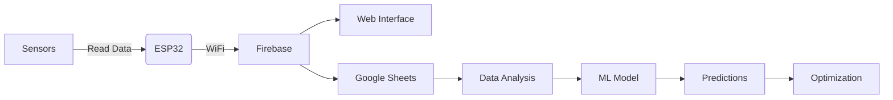

# Smart Hydroponic: IoT and ML Driven Sustainable Farming


## 🌱 Project Overview
Smart Hydroponic is an innovative IoT and Machine Learning based solution for sustainable farming. This project integrates sensor data collection, real-time monitoring, and predictive analytics to optimize plant growth in hydroponic systems.

## 🚀 Key Features

- **Real-time Monitoring**: Track environmental parameters (temperature, humidity, pH, nutrients, etc.)
- **Automated Alerts**: Get notified about critical conditions
- **Data Analytics**: ML-powered insights for better crop management
- **Remote Control**: Manage your hydroponic system from anywhere
- **Energy Efficient**: Optimized for low power consumption
- **Scalable**: Supports multiple sensor nodes and expansion

## 🛠️ Hardware Requirements

- ESP32 Microcontroller
- DHT22 Temperature & Humidity Sensor
- TDS Sensor (Total Dissolved Solids)
- pH Sensor
- EC (Electrical Conductivity) Sensor
- Water Level Sensor
- Submersible Water Pump
- Relay Module
- Power Supply (12V/5V)

## 📋 Software Requirements

- Arduino IDE
- PlatformIO (recommended)
- Node.js (for web interface)
- Python 3.7+ (for ML components)
- Google Sheets API (for data logging)
- Firebase (for real-time data)

## 🚀 Installation

### 1. Clone the Repository
```bash
git clone https://github.com/yourusername/smart-hydroponic.git
cd smart-hydroponic
```

### 2. Hardware Setup
1. Connect sensors to ESP32 as per the wiring diagram
2. Ensure stable power supply
3. Verify all connections

### 3. Software Setup
1. Install required Arduino libraries
2. Configure WiFi credentials in `config.h`
3. Set up Firebase project and update credentials
4. Deploy Google Apps Script for Google Sheets integration

### 4. Web Interface
```bash
cd web-interface
npm install
npm start
```

## 🔧 Configuration

### Environment Variables
Create a `.env` file in the project root:
```
FIREBASE_API_KEY=your_firebase_api_key
FIREBASE_AUTH_DOMAIN=your_project_id.firebaseapp.com
FIREBASE_DATABASE_URL=https://your_project_id.firebaseio.com
GOOGLE_SHEETS_ID=your_google_sheet_id
```

### Google Sheets Setup
1. Create a new Google Sheet
2. Enable Google Apps Script
3. Copy the script from `google_sheet/Code.gs`
4. Deploy as a web app

## 🤖 Machine Learning Components

### Training the Model
```bash
cd ml
python train_model.py --data dataset.csv --output model.h5
```

### Making Predictions
```bash
python predict.py --model model.h5 --input input_data.json
```

## 📊 Data Flow



## 📝 License

This project is licensed under the MIT License - see the [LICENSE](LICENSE) file for details.

## 🙏 Acknowledgments

- Built with ❤️ by Fahim Ur Rehman Shah
- Special thanks to all open-source contributors
- Icons by [Material Icons](https://material.io/resources/icons/)

## 📬 Contact

For any queries or contributions, please reach out to [fahimshah651@gmail.com](mailto:your.email@example.com)
