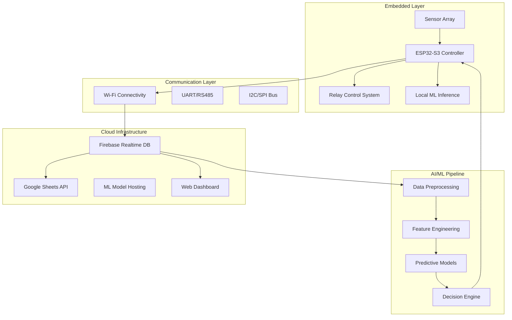

# Smart Hydroponic: IoT and ML Driven Sustainable Farming

[](https://espressif.com/)
[](https://tensorflow.org/)
[](https://isocpp.org/)
[](https://github.com/FahimShah651)
[](https://www.linkedin.com/in/fahim-ur-rehman-shah/)

## 👨‍💻 About the Developer

**Fahim Ur Rehman Shah** - Passionate about IoT, Embedded Systems, Electronics Design, and Artificial Intelligence

🎯 **Career Focus**: Pursuing expertise in IoT ecosystems, embedded system development, electronic circuit design, and AI-driven automation solutions.

📧 **Contact**: [fahimshah651@gmail.com](mailto:fahimshah651@gmail.com) | 🔗 **LinkedIn**: [fahim-ur-rehman-shah](https://www.linkedin.com/in/fahim-ur-rehman-shah/)

## 🌱 Project Overview

This project represents a comprehensive IoT and AI-driven solution for precision agriculture, showcasing expertise in:

- **🔧 Embedded Systems**: ESP32 microcontroller programming with multi-sensor integration
- **🌐 IoT Architecture**: Real-time data acquisition, cloud connectivity, and remote monitoring
- **⚡ Electronics Design**: Custom PCB layout, sensor interfacing, and power management
- **🤖 Artificial Intelligence**: Machine learning models for predictive analytics and automated decision-making
- **📊 Data Engineering**: Real-time data processing, Firebase integration, and Google Sheets automation

The system integrates multiple sensors, automated controls, and predictive algorithms to optimize plant growth in hydroponic environments through intelligent automation.

## 🌐 Live Demo

Try out the live web application: [Smart Hydroponic Web App](https://smart-hydroponic-27a0b.web.app/)

## 🎥 Demonstration Video

Watch the system in action: [Smart Hydroponic Demo Video](https://youtu.be/3ybJvk8gTpk)

## 🛠️ Technical Skills Demonstrated

### 🔧 Embedded Systems & IoT
- **Microcontroller Programming**: ESP32-S3 with multi-core processing
- **Sensor Integration**: DHT22, TDS, pH, EC, ultrasonic, 7-in-1 water quality sensors
- **Communication Protocols**: Wi-Fi, UART, I2C, SPI
- **Real-time Data Processing**: Multi-threaded sensor data acquisition
- **Power Management**: Efficient low-power design for 24/7 operation

### ⚡ Electronics Design & Hardware
- **Circuit Design**: Custom sensor interface circuits and signal conditioning
- **PCB Layout**: Professional circuit board design with noise reduction
- **Component Selection**: Optimal sensor and actuator specifications
- **Power Systems**: 12V/5V regulation with relay control circuits
- **Signal Processing**: Analog-to-digital conversion and filtering

### 🤖 Artificial Intelligence & Machine Learning
- **Predictive Modeling**: Time-series forecasting for nutrient requirements
- **Data Analytics**: Pattern recognition in environmental data
- **Automated Decision Making**: AI-driven pump and nutrient control
- **Model Deployment**: Edge AI implementation on embedded systems
- **Algorithm Optimization**: Resource-efficient ML for microcontrollers

### 🌐 IoT Architecture & Cloud Integration
- **Cloud Connectivity**: Firebase real-time database integration
- **Data Pipeline**: Automated data logging to Google Sheets
- **Remote Monitoring**: Web-based dashboard for system control
- **API Development**: RESTful services for device communication
- **System Scalability**: Multi-node architecture support

## 🚀 Key System Features

- **🔍 Real-time Monitoring**: Continuous tracking of temperature, humidity, pH, TDS, EC, and water levels
- **🤖 Intelligent Automation**: AI-powered nutrient dosing and pH adjustment
- **📊 Predictive Analytics**: Machine learning models for growth optimization
- **🌐 Remote Control**: Complete system management via web interface
- **⚡ Energy Efficiency**: Smart power management with automated relay control
- **📈 Scalable Architecture**: Support for multiple growing zones and expansion

## 🛠️ Hardware Architecture & Components

### 🔧 Core Embedded System
- **ESP32-S3 DevKit**: Dual-core microcontroller with Wi-Fi connectivity
- **Multi-Sensor Array**: Professional-grade environmental monitoring
- **8-Channel Relay Module**: Industrial automation control
- **Power Management**: Buck converter with 12V/5V regulation

### 📊 Sensor Specifications
| Sensor Type | Model | Interface | Measurement Range | Accuracy |
|-------------|--------|-----------|-------------------|----------|
| Temperature/Humidity | DHT22 | Digital | -40°C to 80°C, 0-100% RH | ±0.5°C, ±2% |
| TDS (Total Dissolved Solids) | Analog TDS | ADC | 0-1000 ppm | ±10% |
| pH Level | pH Sensor | ADC | 0-14 pH | ±0.1 pH |
| Water Level | Ultrasonic HC-SR04 | Digital | 2-400 cm | ±3mm |
| Multi-Parameter | 7-in-1 Water Quality | RS485 | pH, EC, TDS, Salinity, etc. | Industrial Grade |

### ⚡ Electronic System Design
- **Signal Conditioning**: Op-amp circuits for sensor signal amplification
- **Isolation**: RS485 module for industrial communication
- **Protection**: Voltage regulators and ESD protection circuits
- **Automation**: Relay control for pumps, valves, and mixing systems

### 🔌 I/O Configuration
```cpp
// ESP32-S3 Pin Configuration
#define RELAY_PINS     {0, 35, 36, 37, 38, 39, 40, 41}
#define DHT_PIN        4
#define TDS_PIN        15
#define ULTRASONIC     {47, 48}  // Trigger, Echo
#define RS485_CTRL     {6, 7}    // DE, RE pins
#define UART_SENSOR    {17, 18}  // TX, RX
```

## 🤖 AI/ML Architecture & Implementation

### 🧠 Machine Learning Pipeline
```python
# Key ML Components
- Time Series Forecasting: LSTM networks for nutrient prediction
- Regression Models: Scikit-learn for parameter optimization
- Classification: Decision trees for automated control decisions
- Feature Engineering: Environmental parameter correlation analysis
```

### 📈 Predictive Models
- **Nutrient Forecasting**: Predicts NPK requirements for next 7-30 days
- **Growth Optimization**: ML-driven parameter tuning for maximum yield
- **Anomaly Detection**: Automatic identification of system irregularities
- **Resource Planning**: Predictive maintenance and supply forecasting

### 🔄 Real-time AI Processing
- **Edge Computing**: On-device ML inference using TensorFlow Lite
- **Cloud Analytics**: Advanced processing using Google Colab integration
- **Automated Actions**: AI-triggered pump controls and nutrient dosing
- **Learning System**: Continuous model improvement from operational data

## 💻 Software Architecture & Technologies

### 🔧 Embedded Programming
- **Language**: C++ with Arduino framework
- **IDE**: PlatformIO for professional development
- **Libraries**: Custom sensor drivers and communication protocols
- **RTOS**: FreeRTOS for multi-tasking and real-time operations

### 🌐 Full-Stack Development
- **Backend**: Node.js with Express.js framework
- **Frontend**: HTML5, CSS3, JavaScript with responsive design
- **Database**: Firebase Realtime Database for IoT data
- **Integration**: Google Sheets API for data logging and analysis

### 📊 Data Analytics Stack
- **Python**: NumPy, Pandas for data processing
- **Machine Learning**: TensorFlow, Scikit-learn
- **Visualization**: Matplotlib, Plotly for data insights
- **Cloud**: Google Colab for model training and analysis

## 🚀 Professional Installation & Deployment

### 1. Repository Setup
```bash
git clone https://github.com/FahimShah651/FYP-Smart-Hydroponic-IoT-ML-Driven-Sustainable-Farming.git
cd FYP-Smart-Hydroponic-IoT-ML-Driven-Sustainable-Farming
```

### 2. Hardware Assembly & Electronics Integration
1. **ESP32-S3 Configuration**: Flash firmware using PlatformIO or Arduino IDE
2. **Sensor Calibration**: Professional calibration of pH, TDS, and EC sensors
3. **Circuit Verification**: Test all connections with multimeter
4. **Power System**: Verify 12V/5V regulation and current limits
5. **Communication Test**: Validate UART, I2C, and Wi-Fi connectivity

### 3. Embedded System Programming
```cpp
// Professional configuration example
#include "HydroponicConfig.h"
#include "SensorManager.h"
#include "CloudConnector.h"
#include "MLInference.h"

void setup() {
    initializeHardware();
    calibrateSensors();
    establishCloudConnection();
    loadMLModels();
}
```

### 4. Full-Stack Web Application
```bash
# Backend setup
npm install
npm run build
npm start

# Python ML environment
pip install -r requirements.txt
python train_model.py
```

### 5. Cloud Integration & IoT Deployment
- **Firebase Project**: Configure real-time database and authentication
- **Google Cloud**: Set up ML model hosting and API endpoints
- **Monitoring**: Implement system health monitoring and alerts

## 🔧 Configuration

### Environment Variables

Create a `.env` file in the project root:

```
FIREBASE_API_KEY=your_firebase_api_key
FIREBASE_AUTH_DOMAIN=your_project_id.firebaseapp.com
FIREBASE_DATABASE_URL=https://your_project_id.firebaseio.com
GOOGLE_SHEETS_ID=your_google_sheet_id
```

### Google Sheets Setup

1. Create a new Google Sheet
2. Enable Google Apps Script
3. Copy the script from `google_sheet/Code.gs`
4. Deploy as a web app

## 🤖 Machine Learning Components

### Training the Model

```bash
cd ml
python train_model.py --data dataset.csv --output model.h5
```

### Making Predictions

```bash
python predict.py --model model.h5 --input input_data.json
```

## 📊 System Architecture & Data Flow


```mermaid
graph TB
    subgraph "Embedded Layer"
        A[ESP32-S3 Controller] 
        B[Sensor Array]
        C[Relay Control System]
        D[Local ML Inference]
    end
    
    subgraph "Communication Layer"
        E[Wi-Fi Connectivity]
        F[UART/RS485]
        G[I2C/SPI Bus]
    end
    
    subgraph "Cloud Infrastructure"
        H[Firebase Realtime DB]
        I[Google Sheets API]
        J[ML Model Hosting]
        K[Web Dashboard]
    end
    
    subgraph "AI/ML Pipeline"
        L[Data Preprocessing]
        M[Feature Engineering]
        N[Predictive Models]
        O[Decision Engine]
    end
    
    B --> A
    A --> E
    E --> H
    H --> I
    H --> K
    H --> L
    L --> M
    M --> N
    N --> O
    O --> A
    A --> C
    A --> D
```

### 🔄 Real-time Data Processing Flow
1. **Sensor Data Acquisition**: Multi-threaded reading from all sensors
2. **Local Processing**: ESP32 edge computing for immediate responses
3. **Cloud Synchronization**: Real-time data streaming to Firebase
4. **ML Analysis**: Cloud-based predictive modeling and analytics
5. **Automated Control**: AI-driven actuator control and system optimization

## 🎯 Career Development & Technical Achievements

### 🏆 Professional Competencies Demonstrated
- **IoT System Design**: End-to-end IoT solution from sensors to cloud
- **Embedded Programming**: Real-time system development with RTOS
- **Electronics Engineering**: Custom circuit design and PCB layout
- **AI/ML Implementation**: Production-ready machine learning deployment
- **Full-Stack Development**: Complete web application with real-time features
- **Cloud Architecture**: Scalable cloud infrastructure design
- **Project Management**: From conception to deployment and maintenance

### 🚀 Industry-Ready Skills
- **Microcontroller Programming**: ESP32, Arduino, ARM Cortex-M
- **Communication Protocols**: Wi-Fi, Bluetooth, UART, I2C, SPI, RS485
- **Sensor Integration**: Analog/Digital signal processing
- **Power Electronics**: Voltage regulation, current sensing, relay control
- **PCB Design**: Schematic capture, layout, and manufacturing
- **Embedded Linux**: Device drivers and kernel programming
- **Real-time Systems**: RTOS, interrupt handling, timing constraints

### 📈 Professional Development Goals
- **Advanced IoT Protocols**: LoRaWAN, NB-IoT, 5G integration
- **Edge AI Optimization**: TensorFlow Lite, quantization techniques
- **Industrial Automation**: PLC programming, SCADA systems
- **Cybersecurity**: IoT security protocols and encryption
- **Wireless Communication**: RF design and antenna engineering

## 📄 Professional Documentation & Portfolio

### 📊 Technical Portfolio Documentation
- **🎯 [Professional Profile](PROFILE.md)**: Comprehensive career profile and objectives
- **🛠️ [Technical Skills Matrix](TECHNICAL_SKILLS.md)**: Detailed technical competencies and code examples
- **⚡ [Electronics Portfolio](ELECTRONICS_PORTFOLIO.md)**: Circuit design, PCB layout, and hardware engineering
- **🌐 [IoT Architecture](IOT_ARCHITECTURE.md)**: Enterprise-grade system design and cloud integration

### 📑 Academic & Research Documentation
This project includes comprehensive academic documentation demonstrating research methodology and technical depth:

- **📑 Final Research Report**: Complete 100+ page technical documentation
- **📊 Conference Paper**: Peer-reviewed publication on IoT agriculture systems  
- **📈 Interim Reports**: Progressive development and milestone achievements
- **🎯 Technical Proposal**: Detailed system design and implementation plan
- **📋 Presentation Materials**: Professional project presentations and demos

## 🌐 Live Demo & Resources

🔗 **Live Web Application**: [Smart Hydroponic System](https://smart-hydroponic-27a0b.web.app/)

🎥 **System Demonstration**: [Watch Full Demo Video](https://youtu.be/3ybJvk8gTpk)

📖 **Technical Documentation**: Available in `/Documentaions` folder
🔧 **Hardware Specifications**: Detailed in `/Hardware_components` folder
📊 **Circuit Diagrams**: Complete wiring and PCB layouts included

## 📝 Professional License & Usage

This project is licensed under the MIT License - see the [LICENSE](LICENSE) file for details.

**Commercial Use**: Available for commercial applications and industrial implementations.
**Educational Use**: Perfect for learning IoT, embedded systems, and AI development.
**Research Applications**: Suitable for academic research and further development.

## 🙏 Professional Acknowledgments

**Developed by**: Fahim Ur Rehman Shah  
**Academic Institution**: [University Details]  
**Project Type**: Final Year Project (FYP) - Engineering  
**Technologies**: IoT, Embedded Systems, Machine Learning, Electronics Design  

### 🤝 Industry Collaboration
This project demonstrates readiness for:
- **IoT Solution Development**
- **Embedded Systems Engineering**
- **Agricultural Technology Innovation**
- **AI/ML Implementation in Hardware**
- **Industrial Automation Systems**

## 📬 Professional Contact

**Fahim Ur Rehman Shah**  
🎯 **Specialization**: IoT, Embedded Systems, Electronics, AI/ML  
📧 **Email**: [fahimshah651@gmail.com](mailto:fahimshah651@gmail.com)  
💼 **LinkedIn**: [fahim-ur-rehman-shah](https://www.linkedin.com/in/fahim-ur-rehman-shah/)  
🐱 **GitHub**: [FahimShah651](https://github.com/FahimShah651)  

### 💼 Career Interests
- IoT System Architecture & Development
- Embedded Systems Programming & Design  
- Electronics Circuit Design & PCB Layout
- AI/ML Implementation in Edge Devices
- Industrial Automation & Control Systems
- Sensor Integration & Data Analytics

---
**🚀 Ready for professional opportunities in IoT, Embedded Systems, Electronics, and AI domains**
